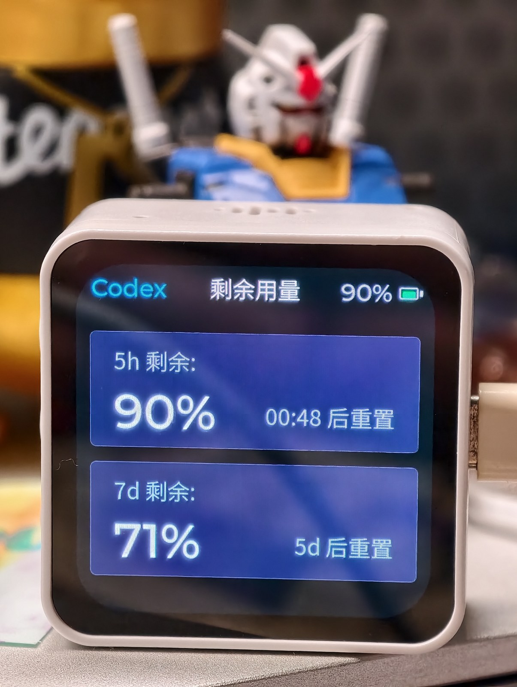
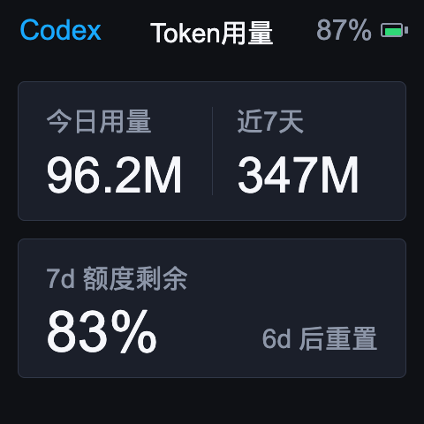
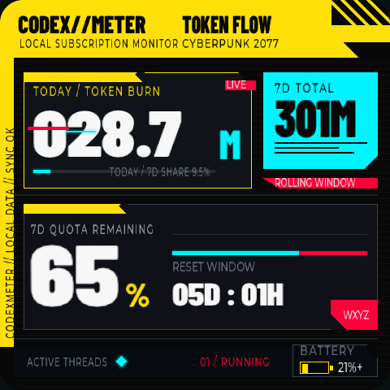
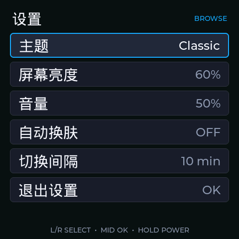
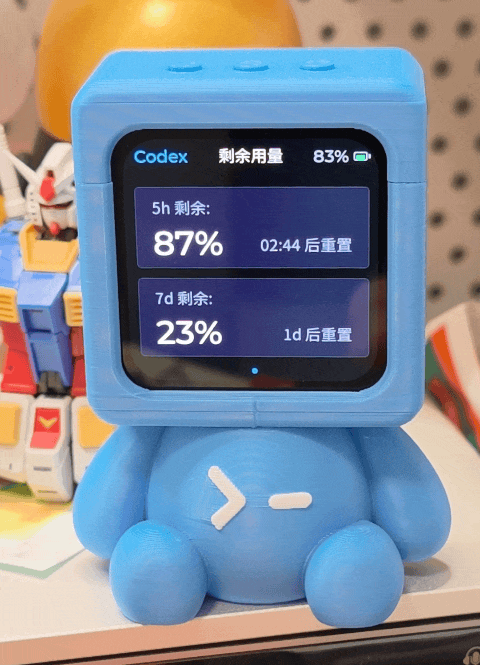
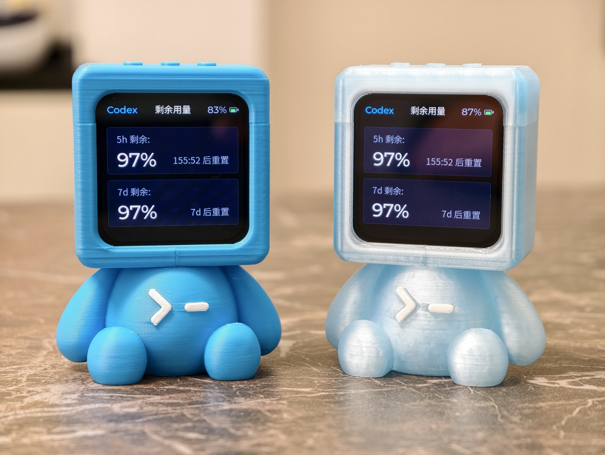

# CodexMeter

[](https://github.com/tomatoeggs/CodexMeter/actions/workflows/python-tests.yml)
[](https://github.com/tomatoeggs/CodexMeter/tags)
[](LICENSE)
[](#兼容性与前置条件)

CodexMeter 是一个基于 ESP32 AMOLED 屏幕的 Codex 订阅余量、Token 活动与任务完成提醒显示器。macOS 后台服务读取本机 Codex 用量，通过 BLE 同步到一台或多台桌面设备。

> A compact macOS + ESP32 display for Codex usage limits and task-completion alerts.

当前稳定版本为 [`v3.2.0`](CHANGELOG.md)。

<p align="center">
  
</p>

<p align="center"><em>CodexMeter 实物运行效果</em></p>

| Token 活动主页（新版） | 5h/7d 余量主页 | 任务完成提醒 |
| --- | --- | --- |
|  |  |  |

| Classic 主题 | Cyberpunk 主题 | Famicom 主题 | Animal Crossing 主题 | 设备设置页 |
| --- | --- | --- | --- | --- |
|  |  |  |  |  |

## 主要功能

- macOS 后台 daemon 定时读取 Codex 订阅剩余用量和每日 Token 活动。
- 通过 BLE 蓝牙把用量和提醒发送到 Waveshare ESP32-S3-Touch-AMOLED-2.16。
- 支持一台 Mac 同时驱动多台已登记的 CodexMeter；设备按稳定短 ID 自动发现和重连。
- ESP32 端内置 `Classic`、`Cyberpunk`、`Famicom` 与 `Animal Crossing` 主题；主题拥有独立布局和动画，并共享同一份只读仪表盘数据。
- 中间键短按进入设备设置页，可调整主题、亮度、自动换肤开关与切换间隔；中间键长按切换亮屏/关屏。
- 支持按 1–1440 分钟的有效展示时间自动轮换主题；关屏、设置页、任务提醒和系统浮层期间暂停计时。
- Codex 返回 5h 窗口时保持原有的 5h/7d 余量主页；只返回 7d 窗口时自动切换为今日/近7天 Token 活动与 7d 余量主页。
- 正常状态由当前主题显示运行中的 Codex 任务数量或状态指示。
- Codex 任务完成后触发红、黄、绿全屏闪动，然后显示“任务完成！”和任务摘要。
- Mac 锁屏或 BLE 通信断开 5 分钟后可自动关屏；Mac 解锁或未锁屏时 BLE 恢复会自动亮屏。
- 正常页会定时在 2px 范围内轻微漂移，降低 AMOLED 固定元素长期停留在同一批像素上的风险。
- 通过板载 QMI8658 IMU 感知重力方向，自动旋转屏幕显示方向。

## 3D 打印外壳

CodexMeter 现在有了一款以 Codex 桌面宠物为灵感的 3D 打印外壳。它把 2.16 英寸 AMOLED 屏幕嵌入宠物头部，在显示 Codex 剩余用量和任务状态的同时，也可以作为桌面摆件；顶部三枚按键仍可正常操作。

> [前往 MakerWorld 查看、下载并打印 CodexMeter 外壳](https://makerworld.com.cn/zh/models/2731561-codexmeter-codex-sheng-yu-yong-liang-yun-xing-zhua#profileId-3169693)

<p align="center">
  
</p>

<p align="center"><em>Codex 桌面宠物造型外壳运行效果</em></p>

<p align="center">
  
</p>

<p align="center"><em>蓝色与冰蓝色外壳实物</em></p>

## 兼容性与前置条件

- 一台运行 macOS 的 Mac；暂不支持多台 Mac 共同驱动同一设备。
- Python 3.11 或更高版本。
- 已安装并登录的 [Codex CLI](https://developers.openai.com/codex/cli/)。
- 已开启蓝牙，并允许启动服务访问蓝牙。
- 一台或多台 Waveshare ESP32-S3-Touch-AMOLED-2.16。
- 编译固件时需要 PlatformIO；`install-mac.sh` 会安装宿主端 Python 依赖，但不会安装 PlatformIO。

## 快速开始

克隆项目并安装 macOS 后台服务与 Codex hooks：

```bash
git clone https://github.com/tomatoeggs/CodexMeter.git
cd CodexMeter
./install-mac.sh
```

首次给开发板烧录 CodexMeter 固件时，确认串口无误后执行：

```bash
.venv/bin/python -m pip install platformio
./flash-mac.sh waveshare_amoled_216 /dev/cu.usbmodemXXXX --force
```

扫描并登记设备；将示例短 ID 替换为扫描结果：

```bash
.venv/bin/codexmeterctl devices scan
.venv/bin/codexmeterctl devices adopt A3F91C --alias Desk
launchctl kickstart -k gui/$(id -u)/com.user.codexmeter
.venv/bin/codexmeterctl status
```

`--force` 只用于尚未运行 CodexMeter 固件、因而无法通过 identity 校验的开发板，或明确的 bootloader 恢复场景。后续升级应优先使用 `./flash-mac.sh --all`。

## 项目结构

- `codexmeter/`：macOS 端核心代码，包括 Codex App Server 客户端、BLE 通信、daemon 和 payload 构造。
- `hooks/codexmeter_start_hook.py`：Codex `UserPromptSubmit` hook，用于标记任务开始。
- `hooks/codexmeter_stop_hook.py`：Codex `Stop` hook，用于标记任务结束并触发完成提醒。
- `firmware/`：ESP32 固件，使用 PlatformIO、Arduino、LVGL、Arduino_GFX、ArduinoJson 和 NimBLE。
- `firmware/src/theme*.{h,cpp}`：主题契约、注册表、运行时与自动轮换策略。
- `firmware/src/classic_theme.*` / `cyberpunk_theme.*` / `famicom_theme.*` / `animal_crossing_theme.*`：当前内置的四套仪表盘主题。
- `firmware/src/device_settings.*`：带版本与 CRC 校验的设备端 NVS 设置。
- `scripts/`：安装 hook 的辅助脚本。
- `tools/capture_screenshot.py`：USB 串口截图采集工具，将 RGB565 帧缓冲转换为 PNG。
- `tools/read_device_logs.py`：USB 串口日志查询工具，用于读取 ESP32 环形日志。
- `install-mac.sh`：安装 macOS 端应用、LaunchAgent 和 Codex hooks。
- `flash-mac.sh`：编译并烧录 ESP32 固件。
- `screenshot.sh`：截图工具入口，默认自动寻找 USB 串口。
- `logs.sh`：ESP32 日志查询工具入口。
- `codex_limits_demo.py`：此前已验证过的 Codex 用量获取 demo，本项目以它作为额度读取逻辑的参考来源。
- `docs/architecture.md`：架构说明。
- `docs/theme-architecture.md`：ESP32 多主题、设置与后续场景扩展说明。
- `docs/themes*.md`：主题设计稿与视觉方向记录。
- `LICENSE`：项目使用的 MIT License。
- `NOTICE.md`：第三方项目参考与许可说明。
- `CONTRIBUTING.md`：贡献指南。
- `SECURITY.md`：安全问题报告说明。
- `CHANGELOG.md`：版本更新日志。
- `.github/`：GitHub issue 模板、PR 模板和 Python 测试 workflow。

## 硬件

当前支持的目标硬件与 Clawdmeter 保持一致：

- Waveshare ESP32-S3-Touch-AMOLED-2.16
- 480x480 AMOLED 屏幕
- AXP2101 电源管理芯片
- QMI8658 六轴 IMU，用于屏幕方向自适应
- 通过 BLE 与 macOS 通信

按键：

- 左键（GPIO0）：仪表盘降低亮度；设置页向上选择或减小当前值。
- 中键（AXP2101 PKEY）：短按进入设置、编辑或确认；长按切换亮屏/关屏。
- 右键（GPIO18）：仪表盘增加亮度；设置页向下选择或增大当前值。

板级引脚配置集中放在 `firmware/include/config.h`。如果硬件版本不同，优先修改这个文件。

## macOS 安装

在项目目录执行：

```bash
./install-mac.sh
```

如果 `codex` 不在默认 `PATH` 中，可以显式指定：

```bash
CODEX_BIN=/path/to/codex ./install-mac.sh
```

安装脚本会完成这些事情：

- 创建或复用 `.venv/` 虚拟环境。
- 安装 `codexmeterd` 和 `codexmeterctl`。
- 写入用户级 LaunchAgent：`com.user.codexmeter`。
- 安装 Codex `UserPromptSubmit` 和 `Stop` hook 到 `~/.codex/hooks.json`，安装前会备份已有文件。

运行中任务通常由 `Stop` hook 结束。对于暂停或中断时不触发 `Stop` 的情况，daemon 会以只读、增量方式监听 start hook 提供的 Codex transcript；识别到当前 `turn_id` 的中断记录后会及时清除活动指示。transcript 不可用、格式未知或读取失败时会静默跳过，不影响正常 hook、用量刷新和 BLE 通信。

`codexmeterctl status` 的 `activity` 字段会显示当前运行任务数、transcript 监听数和涉及的文件数，便于确认中断恢复链路是否正在工作。

每个运行中任务还拥有独立的活动租约。transcript 有任何新增内容都会续租；如果 Hook 和 transcript 同时失效，任务连续 60 分钟没有活动后会被 daemon 自动清理。daemon 每 30 秒检查一次，过期只更新活动指示，不会生成任务完成提醒。`activity.oldest_age_sec` 和 `activity.next_expiry_sec` 分别显示最老任务年龄及最近租约的剩余时间。可通过 `codexmeterd --activity-ttl <秒>` 调整，设置为 `0` 可关闭 TTL。

常用命令：

以下命令默认在项目根目录执行；如果已经激活 `.venv`，也可以直接使用 `codexmeterctl`。

```bash
tail -F ~/.codexmeter/codexmeter.log ~/.codexmeter/codexmeter.out.log ~/.codexmeter/codexmeter.err.log
.venv/bin/codexmeterctl once
.venv/bin/codexmeterctl status
.venv/bin/codexmeterctl devices scan
.venv/bin/codexmeterctl devices adopt A3F91C --alias Home
.venv/bin/codexmeterctl demo-alert "构建任务已完成"
.venv/bin/codexmeterctl demo-usage --h5 72 --d7 84
.venv/bin/codexmeterctl demo-usage --no-h5 --today-tokens 18600000 --week-tokens 236000000
.venv/bin/codexmeterctl demo-activity --count 2
.venv/bin/codexmeterctl screen-on
.venv/bin/codexmeterctl screen-off
```

如果修改了 macOS 端代码，可以重启 daemon：

```bash
launchctl kickstart -k gui/$(id -u)/com.user.codexmeter
```

## Codex 用量读取

daemon 通过本地 Codex App Server 读取订阅余量：

1. 启动 `codex app-server --listen stdio://`
2. 发送 `initialize`
3. 发送 `initialized`
4. 读取 `account/read`
5. 读取 `account/rateLimits/read`
6. 尝试读取 `account/usage/read`

当前只处理 `codex` 限额桶：

- 300 分钟窗口映射为 `5h`
- 10080 分钟窗口映射为 `7d`

`account/usage/read` 的 `dailyUsageBuckets` 用于计算今日和包含今日在内的近 7 个自然日 Token 数。服务端尚未生成当天桶时，daemon 会只读取本机 `~/.codex/sessions` 中的 `token_count` 事件，以累计值增量补出今日数据并加入近7天；这个实时回退只覆盖当前 Mac。服务端当天桶出现后会与本机值比较：差异小则使用账号级数据；差异同时达到 100 万 Token 和 25% 时，以本机今日值为准，并替换近7天合计中的当天部分。daemon 会在每日桶或数据源选择变化时记录 UTC/本地观察时间、最近的服务端桶、差值和最终数据源，便于后续判断服务端的自然日边界。该接口和本地事件均作为可选能力处理：不可用时限额刷新仍会继续，并优先保留上次成功取得的 Token 活动数据。

daemon 不读取、不打印 Codex 登录 token。

## 屏幕显示

正常状态会按 Codex 实际返回的数据自动选择一种布局：

- 存在 5h 窗口：保留原布局，顶部显示“剩余用量”，两张卡片分别显示 5h/7d 剩余百分比和重置倒计时。
- 不存在 5h 窗口且 7d 数据有效：顶部显示“Token用量”，第一张卡片显示“今日用量”和“近7天”Token，第二张卡片显示“7d 额度剩余”和重置倒计时。

两种布局共同包含：

- 当前主题自行决定标识、电量、Token、额度、重置窗口和任务指示的具体排版；四套内置主题使用完全独立的 LVGL 结构。
- 运行中任务由主题自行表达：Cyberpunk 最多显示 6 个状态菱形，Famicom 与 Animal Crossing 使用数字计数；没有运行中任务时显示空闲状态。
- 仪表盘中左/右按键短按分别降低/增加亮度；亮度范围为 10%-100%，每次调整 10%，调整后显示 3 秒亮度进度条。
- 中间键短按进入设置页，长按切换 AMOLED 亮屏和关闭；屏幕关闭时 BLE、任务计数、日志和用量刷新仍会继续运行。
- Mac 锁屏持续 5 分钟后，daemon 会发送关屏控制；Mac 解锁后会立即发送亮屏控制。
- ESP32 与 Mac 的 BLE 通信断开持续 5 分钟后，固件会本地关屏；通信恢复时，只有 Mac 当前未锁屏才会由 daemon 发送亮屏控制。
- 正常页每 10 分钟在 2px 范围内整体轻微漂移；任务完成提醒和亮度浮层不参与漂移。
- 设备旋转时，固件会读取 QMI8658 加速度计并在 0/90/180/270 度之间自动切换显示方向；切换时会短暂压暗屏幕并重绘，减少半帧撕裂感。

## 主题与设备设置

主题系统完全运行在 ESP32 展现层。macOS daemon 仍只同步用量、任务活动、提醒和屏幕控制，换肤不需要新增 BLE payload，也不会让 Mac 端持有设备主题状态。

当前内置主题：

- `classic`：延续原有 CodexMeter 深色卡片布局。
- `cyberpunk`：以高对比黄、青、红和工业信息面板构成的 Cyberpunk 2077 风格仪表盘。
- `famicom`：以老化象牙白机身、酒红卡带区、嵌入式数据窗和十字键 / A/B 键构成的红白机硬件面板。
- `animal_crossing`：以海岛场景、黄色帐篷、悬挂便笺、叶片额度徽章、木制路标和狸克构成的岛屿日报。

设置页包含主题、屏幕亮度、音量、自动换肤、切换间隔和退出设置。音量值当前仅作为持久化能力预留，目标硬件尚未接入声音输出。设置页 30 秒无操作会自动退出；编辑中的未确认值会恢复。自动换肤只累计仪表盘真正可见的时间，范围为 1 分钟至 24 小时。

主题接口已为开机动画和任务完成页预留独立扩展点，当前这两个场景继续使用系统默认实现。新增主题时请参阅 [`docs/theme-architecture.md`](docs/theme-architecture.md)。

## 多设备

每台固件会用 ESP32 稳定芯片 ID 生成身份，并以短名广播：

```text
CodexMeter-A3F91C
```

Mac 端只会自动连接已登记设备。首次使用一台新设备时：

```bash
.venv/bin/codexmeterctl devices scan
.venv/bin/codexmeterctl devices adopt A3F91C --alias Home
launchctl kickstart -k gui/$(id -u)/com.user.codexmeter
```

`alias` 只是本机显示标签，不参与连接判断。daemon 运行后会持续扫描附近 CodexMeter；当你带 Mac 从公司回家，办公室设备会离线，家里的已登记设备被扫描到后会由独立 worker 连接。在 macOS 上，discovery 会合并广播结果和 CoreBluetooth 已连接外设，避免设备因残留系统连接停止广播后无法重新接管。每台设备有独立队列、ACK、重连 backoff 和健康状态；单台设备假活或断电不会阻塞其他设备。首次连接后，daemon 会读取 identity characteristic，把短 ID 登记记录原子升级为完整芯片 ID；后续连接必须通过完整 identity 校验。

状态类 payload 会保存每台设备的最新期望值并在重连后恢复。告警在收到设备 ACK 前保持为 in-flight；ACK 丢失时会重试，固件按告警 ID 去重，因此不会因为瞬时断连而漏提醒或重复闪屏。

查看登记设备：

```bash
.venv/bin/codexmeterctl devices list
```

任务完成提醒：

- 先红、黄、绿全屏闪动。
- 闪动结束后显示“任务完成！”。
- 下方最多显示四行 Codex 任务摘要，超出部分在第四行省略；正文使用 LittleFS 中的 TTF 字体经 LVGL TinyTTF 本地渲染。
- 摘要在 macOS 端只移除控制字符并保留 Unicode 文本，中文覆盖主要由设备端 TTF 字体负责；TTF 缺失的常见智能标点由内置 UI 字体兜底。
- 默认在文字出现后停留 8 秒；提醒显示时关屏会同时关闭当前提醒。

## 固件编译与烧录

项目优先使用 `.venv/bin/pio`，如果不存在再回退到系统 `pio`。PlatformIO 缓存默认放在项目内的 `.platformio/`。

如果没有安装 PlatformIO，可以先安装：

```bash
.venv/bin/python -m pip install platformio
```

连接设备后执行：

```bash
./flash-mac.sh waveshare_amoled_216
```

如果需要指定串口：

```bash
./flash-mac.sh waveshare_amoled_216 /dev/cu.usbmodem211201
```

同时烧录所有已通过 identity 校验的 CodexMeter：

```bash
./flash-mac.sh --all
```

自动发现和 `--all` 不会选择其他 USB 串口。首次给尚未运行 CodexMeter 固件的开发板烧录，或设备停在 bootloader、无法回应 identity 查询的恢复场景，才应在确认端口后显式追加 `--force`：

```bash
./flash-mac.sh waveshare_amoled_216 /dev/cu.usbmodem211201 --force
```

只编译不烧录：

```bash
PLATFORMIO_CORE_DIR="$PWD/.platformio" \
UV_CACHE_DIR="$PWD/.platformio/.cache/uv" \
.venv/bin/pio run -d firmware -e waveshare_amoled_216
```

## 串口调试

固件支持通过串口输入 demo 命令：

```text
demo_usage
demo_token_usage
demo_alert
demo_activity
demo_idle
identity
screen_on
screen_off
screen_toggle
brightness_down
brightness_up
brightness 80
theme
theme_list
theme_next
theme_prev
theme classic
theme cyberpunk
theme famicom
theme animal_crossing
settings_open
settings_close
settings_state
auto_theme on
auto_theme off
theme_interval 10
volume 50
imu
rotate auto
rotate 0
rotate 90
rotate 180
rotate 270
screenshot
logs
logs 20
log_clear
```

也可以直接发送 BLE JSON payload 形状的消息：

```json
{"v":1,"k":"usage","src":"codex","h5":72,"h5r":1783093200,"d7":84,"d7r":1783545600,"td":18600000,"t7":236000000,"st":"ok","t":1783070000}
```

要直接预览 Token 活动布局，可令 `h5` / `h5r` 为 `null`，或在串口输入 `demo_token_usage`。

```json
{"v":1,"k":"alert","id":"demo","title":"任务完成！","body":"Codex 已完成测试任务","t":1783070000}
```

```json
{"v":1,"k":"activity","src":"codex","run":2,"t":1783070000}
```

屏幕控制 payload：

```json
{"v":1,"k":"control","cmd":"screen","on":true,"why":"mac_unlocked","t":1783070000}
```

## USB 截图与视觉 QA

固件支持通过 USB 串口执行 `screenshot` 命令，返回当前屏幕物理方向的 RGB565 快照。项目根目录提供宿主侧工具，可直接保存 PNG：

```bash
./screenshot.sh out.png
```

如果机器上有多个串口，可以显式指定设备：

```bash
./screenshot.sh out.png /dev/cu.usbmodem211201
./screenshot.sh out.png --device A3F91C
./screenshot.sh --list
```

截图工具使用纯 Python 实现串口读取和 PNG 编码，不依赖 `ffmpeg` 或 `pyserial`。当前目标板带 PSRAM，可支持 480x480 全帧截图；未来若适配无 PSRAM 板，固件会返回 `SCREENSHOT_UNSUPPORTED`。当 USB 同时接入多台 CodexMeter 时，未指定 `--device` 或 port 会报错并要求明确目标，避免误操作。

## ESP32 日志查询

固件会把关键运行事件写入一个 48 条的设备端环形日志，包括启动、PMU、BLE 连接/断开、payload 解析、用量更新、活动任务数、提醒和截图状态。日志仍会实时打印到 USB 串口，也可以按需查询：

```bash
./logs.sh
```

只看最近 20 条：

```bash
./logs.sh -n 20
```

指定串口：

```bash
./logs.sh -n 20 /dev/cu.usbmodem211201
./logs.sh -n 20 --device A3F91C
./logs.sh --list
```

清空设备端日志：

```bash
./logs.sh --clear
```

跟随实时串口日志：

```bash
./logs.sh --follow
```

查询输出格式为：

```text
LOGS_START 2
LOG 12 3401 INFO BLE connected xx:xx:xx:xx:xx:xx
LOG 13 3550 INFO usage h5=72 d7=64 status=ok
LOGS_END
```

macOS daemon 日志使用轮转文件，当前文件和一个备份合计最多约 100MB。

## BLE 协议

设备名：

```text
CodexMeter-<short_id>
```

GATT UUID：

- service：`4c41555a-4465-7669-6365-000000000001`
- RX write：`4c41555a-4465-7669-6365-000000000002`
- TX notify：`4c41555a-4465-7669-6365-000000000003`
- refresh notify：`4c41555a-4465-7669-6365-000000000004`
- identity read：`4c41555a-4465-7669-6365-000000000005`

用量 payload：

```json
{"v":1,"k":"usage","src":"codex","h5":72,"h5r":1783093200,"d7":84,"d7r":1783545600,"st":"ok","t":1783070000}
```

提醒 payload：

```json
{"v":1,"k":"alert","id":"abc","title":"任务完成！","body":"摘要","t":1783070000}
```

`task_complete` 生成的提醒 payload 会额外携带当前运行中任务数，固件会在显示提醒前同步更新底部小蓝点：

```json
{"v":1,"k":"alert","id":"abc","title":"任务完成！","body":"摘要","run":0,"t":1783070000}
```

运行中任务 payload：

```json
{"v":1,"k":"activity","src":"codex","run":2,"t":1783070000}
```

字段说明：

- `v`：协议版本。
- `k`：payload 类型，当前支持 `usage`、`alert`、`activity` 和 `control`。
- `src`：用量来源，当前为 `codex`，预留给未来其他订阅来源。
- `h5` / `d7`：剩余百分比。
- `h5r` / `d7r`：重置时间戳，单位为秒。
- `st`：状态，例如 `ok` 或 `stale`。
- `t`：payload 生成时间戳，固件用它计算重置倒计时。
- `title` / `body`：提醒标题和正文。
- `run`：当前正在运行的 Codex 任务数量。固件用它在底部居中显示小蓝点。
- `cmd` / `on` / `why`：控制命令、屏幕目标状态和触发原因；当前 `control` 只支持 `cmd:"screen"`。

payload 会控制在 512 bytes 以内。

## 测试

运行 Python 测试：

```bash
.venv/bin/python tests/run_tests.py
```

常用端到端验证：

```bash
.venv/bin/codexmeterctl status
.venv/bin/codexmeterctl devices scan
.venv/bin/codexmeterctl demo-usage --h5 72 --d7 84
.venv/bin/codexmeterctl demo-alert "任务完成提醒测试"
.venv/bin/codexmeterctl demo-activity --count 3
.venv/bin/codexmeterctl screen-off --reason test
.venv/bin/codexmeterctl screen-on --reason test
```

## 故障排查

查看 daemon 日志：

```bash
tail -F ~/.codexmeter/codexmeter.log ~/.codexmeter/codexmeter.out.log ~/.codexmeter/codexmeter.err.log
```

确认 daemon 是否运行：

```bash
.venv/bin/codexmeterctl status
```

重启 daemon：

```bash
launchctl kickstart -k gui/$(id -u)/com.user.codexmeter
```

如果设备刚烧录完成，BLE 会短暂断开，daemon 通常会自动扫描并重连。

如果 CoreBluetooth 连接处于假活状态，daemon 会在 BLE 连接、断开清理、notify 订阅、写入或设备 ACK 超时后结束本次会话，并重新扫描连接。设备仍被 CoreBluetooth 标记为已连接而不再广播时，discovery 会通过 service UUID 检索并重新接管它。默认连接超时为 15 秒，断开清理和 notify 订阅超时为 5 秒，写入和 ACK 超时都是 10 秒，应用层 heartbeat 间隔为 45 秒；可通过 `codexmeterd --ble-connect-timeout`、`--ble-disconnect-timeout`、`--ble-write-timeout`、`--ble-ack-timeout`、`--ble-notify-timeout` 和 `--ble-healthcheck-interval` 调整。`codexmeterctl status` 会额外显示 BLE 连接状态、队列深度、最近发现来源、最近写入/ACK 时间、连续失败次数和 discovery 扫描健康状态。

如果 7d 用量短暂跳到 `100%` 且显示 `7d 后重置`，通常是 Codex App Server 返回了临时空窗口。daemon 会过滤这类单次异常快照，并在日志中记录 `Rejected transient usage sample`、原始 `h5/d7/h5r/d7r` 和最终排队的可信值。

如果任务完成提醒没有出现，优先检查：

- `~/.codex/hooks.json` 中是否存在 CodexMeter `UserPromptSubmit` 和 `Stop` hook。
- `~/.codexmeter/codexmeter.log` 中是否出现 `Queued local alert`。

## 参考与许可

CodexMeter 参考了 [HermannBjorgvin/Clawdmeter](https://github.com/HermannBjorgvin/Clawdmeter) 的硬件方向和 BLE JSON 通信思路，并沿用兼容的自定义 GATT UUID 形状。

当前实现没有直接引入大量 Clawdmeter 源码。若未来复制上游源码文件，应在对应文件旁保留原始版权与许可说明。

CodexMeter 使用 [MIT License](LICENSE) 开源。第三方参考与许可说明见 [NOTICE.md](NOTICE.md)，参与开发前请阅读 [CONTRIBUTING.md](CONTRIBUTING.md)，安全问题请按 [SECURITY.md](SECURITY.md) 私密报告。
