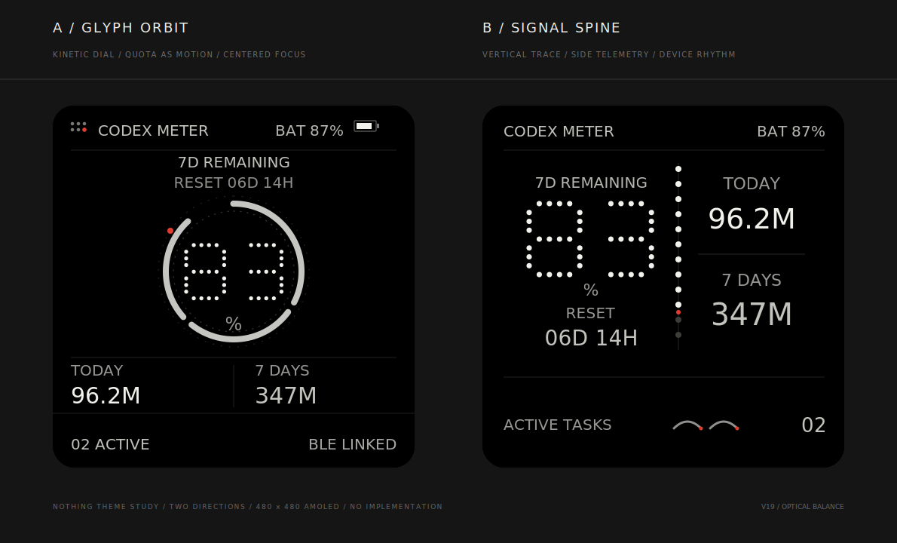

# CodexMeter Nothing 主题方向 V19（A / B 待选择）

V6 `Dot Signal` 已作为独立备份保留。当前保留 A `Glyph Orbit` 和 B `Signal Spine` 两条可继续深化的方向。

## A / Glyph Orbit

- 定位：最像 Nothing Phone 背部 Glyph 系统的动态仪表。
- 主视觉：`83%` 放入完整的断续双轨圆环中；亮弧总长度对应 83%。
- 可读性修订：`RESET 06D 14H` 回到 `7D REMAINING` 主模块内，与标题纵向成组；不增加长条信息带。圆环适度缩小并下移，让标题、Reset、圆环之间都有明确留白，点阵 `83` 继续与内环保持安全距离。
- 信息层级：配额为中心，今日 / 7 天 Token 放在底部对称数据带。
- 气质：最有动势、最像可穿戴设备，但进度表达也最强。

## B / Signal Spine

- 定位：把 Nothing 的光点语言做成一条纵向设备信号轨。
- 主视觉：大型点阵 `83%` 位于左侧；12 点配额轨在几何中轴基础上向右进行小幅视觉补偿，以平衡更密集的左侧配额信息与右侧用量信息。
- 信息层级：进度轨移动时，两侧标题、数值、Reset 和用量分割线同步重新居中，保持完整网格关系；活动任务保持为底部第三层信息。
- 可读性修订：右侧不使用方块和附加说明，只保留 Today / 7 Days 标签与主数值；两组内容在各自空间内放大并居中，中间增加一条短而克制的分割线。
- 底部利用：取消独立的大圆弧区域，将 `ACTIVE TASKS`、两枚浅弧 Glyph 与 `02` 合并为单行状态栏；圆弧去除强辉光和复杂分段，只作为任务数量的轻量辅助符号。
- 气质：最像未来设备、信息密度最高，动态演绎空间最大。

## 备份

- V6 视觉稿：[`assets/themes-preview-v6.svg`](assets/themes-preview-v6.svg)
- V6 设计说明：[`themes-v6.md`](themes-v6.md)

A 和 B 都保留今日 Token、近 7 天 Token、7d 剩余配额、重置时间、电量和活动任务数。
