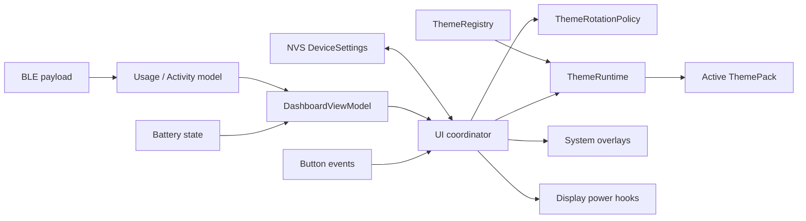
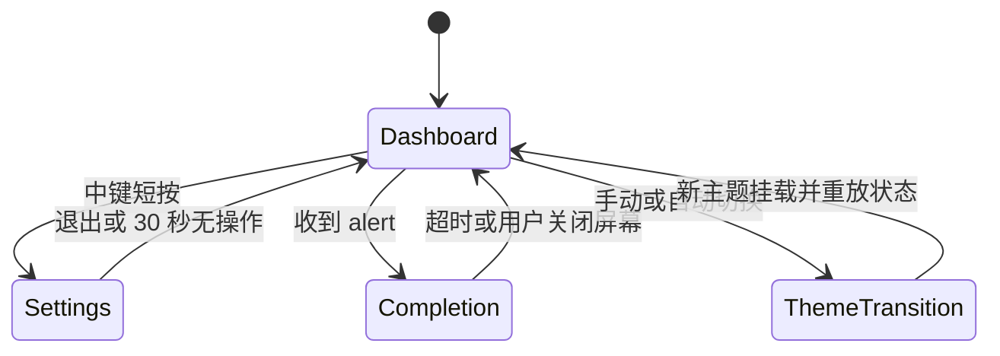

# CodexMeter 多主题与设置架构

本文描述 v3.x 已落地的 ESP32 多主题基础设施，以及后续主题化启动动画和任务完成页的扩展边界。主题系统只属于设备端展现层：macOS daemon 继续同步既有业务数据，BLE 协议不负责选择或保存主题。

## 0. 当前实现状态

已经实现：

- `DashboardViewModel`、`ThemePack`、主题注册表与单主题运行时生命周期。
- `Classic`、`Cyberpunk` 和 `Famicom` 三套独立仪表盘。
- 设备本地设置页、中键短按/长按语义、自动换肤和 NVS 持久化。
- 设置、提醒、关屏与系统浮层期间暂停自动轮换。
- Startup / Completion 的强类型接口预留。

尚未启用：

- 主题自定义开机动画和任务完成页；当前仍由系统默认场景渲染。
- 主题播放列表和外部主题包加载；当前按编译期注册表顺序轮换。
- 真实声音输出；音量值只作为未来能力预留。

## 1. 结论

不建议在当前 `ui.cpp` 中继续增加 `if (theme == ...)`。主题系统应拆成四层：

1. **状态层**：保存最新用量、活动任务、电量、连接状态和提醒内容。
2. **策略层**：处理按键、自动轮换、场景切换和屏幕电源。
3. **主题层**：只负责把只读 ViewModel 渲染成 LVGL 对象。
4. **系统层**：负责亮度、旋转、截图、BLE、NVS 和显示硬件。

主题是“渲染策略”，不是新的业务状态，也不拥有 BLE 数据。

当前核心行为：

- 中间键短按：进入设置页；在设置页中用于进入编辑或确认。
- 中间键长按约 2 秒：亮屏 / 关屏。
- 设置页中左右键用于上下选择；编辑时用于调值或预览主题。
- 自动轮换：在仪表盘真实可见时累计时间，到期后切换一次。
- 屏幕关闭、启动动画、任务完成页和系统浮层期间暂停自动轮换。
- 自动轮换不写 Flash；手动选择和设置变更经过防抖后才持久化。
- 任务完成页和启动动画保留主题接口；当前使用系统默认版本。

## 2. 当前结构的约束

v3.0 已把原先的固定 UI 拆为主题无关的 ViewModel、运行时和 `classic` 主题，并以 `cyberpunk` 验证主题可以拥有完全不同的对象树、排版和动画；v3.1 新增的 `famicom` 进一步验证了同一接口可以承载差异显著的硬件拟物布局。`ui.cpp` 只协调场景与系统浮层，不再通过主题分支维护多套控件。

当前仍有两项刻意保留在系统层：

- 任务完成闪屏和摘要页尚未交给主题运行时。
- 屏幕电源与方向切换仍由 `main.cpp` 串行控制硬件亮度。

这两个边界避免首个主题里程碑同时改动告警可靠性和显示硬件时序。

## 3. 当前模块

v3.x 采用以下固件模块。后续规模扩大时可以在不改变接口的前提下移动到子目录：

```text
firmware/src/
├── dashboard_view_model.h/.cpp  # 统一计算语义数据与格式
├── device_settings.h/.cpp       # 带版本、CRC 和防抖写入的 NVS 设置
├── theme.h                      # 强类型 ThemePack / surface 接口
├── theme_registry.h/.cpp        # 编译期主题注册表
├── theme_runtime.h/.cpp         # 当前 Dashboard 主题生命周期
├── theme_rotation.h/.cpp        # 自动切换纯逻辑策略
├── classic_theme.h/.cpp         # 迁移后的原始主题
├── cyberpunk_theme.h/.cpp       # Cyberpunk 独立仪表盘
├── famicom_theme.h/.cpp         # 红白机硬件面板仪表盘
├── ui.h/.cpp                    # 场景、浮层与设置页协调器
├── power.h/.cpp                 # 中键短按 / 长按语义事件
└── main.cpp                     # 板级初始化与主循环调度
```

### 模块关系



## 4. 状态层：业务数据只保存一份

固件只保存一份最新状态，当前由 UI 协调器持有用量、活动、电量与提醒模型：

```cpp
struct AppState {
  UsageModel usage;
  ActivityModel activity;
  BatteryState battery;
  ConnectionState connection;
  AlertModel completion;
};
```

`DashboardViewModelBuilder` 负责统一计算：

- 今日和 7 天 Token 的规范化数值。
- 今日 / 7 天占比及其有效性。
- 7d 剩余百分比。
- 重置剩余秒数。
- 电量、充电状态和任务数。
- `waiting`、`ok`、`stale` 等数据状态。

主题可以决定排版、标签和视觉图形，但不能重新解释业务数据。例如 27.7% 的计算只能在 ViewModel 层出现一次，所有主题读取同一个结果。

主题切换后，`ThemeRuntime` 会立即把完整的最新 ViewModel 重放给新主题，不需要等待下一条 BLE 消息。

## 5. 主题接口

主题使用稳定字符串 ID，例如：

```text
classic
cyberpunk
nothing
famicom
island
wild
```

不能持久化注册表下标，因为添加或调整主题顺序会让旧设置指向错误主题。

建议接口：

```cpp
struct ThemeDashboardOps {
  size_t state_size;
  bool (*mount)(void* state, lv_obj_t* parent,
                const ThemeResources& resources);
  void (*update)(void* state, const DashboardViewModel& model);
  void (*tick)(void* state, uint32_t now_ms);
  void (*unmount)(void* state);
};

struct ThemePack {
  const char* id;
  const char* display_name;
  uint16_t manifest_version;
  uint8_t drift_margin_px;
  ThemeDashboardOps dashboard;
  const ThemeStartupOps* startup;        // 可空，空时使用系统默认
  const ThemeCompletionOps* completion;  // 可空，空时使用系统默认
};
```

接口约束：

- 主题只能访问传入的只读 ViewModel 和资源服务。
- 主题不能读写 BLE、NVS、屏幕电源或全局业务模型。
- 所有动画必须通过非阻塞 `tick(now_ms)` 推进，禁止 `delay()`。
- 主题不能创建脱离场景生命周期的 LVGL timer。
- `unmount()` 后所有主题私有指针必须失效，不能被其他模块保存。
- `mount()` 即使失败，状态也必须允许协调器安全调用一次 `unmount()`。
- 动画帧中禁止临时创建 LVGL 对象或字体；对象在 `mount()` 时一次性建立。
- Dashboard、Startup、Completion 使用不同的 ViewModel 和函数指针类型，避免未来把完成任务数据误传给仪表盘接口。

## 6. UI 场景与图层

v3.0 使用以下图层：

```text
lv_screen_active()
├── theme_host          # 当前主题 Dashboard，参与防烧屏漂移
├── alert_layer         # 系统默认 Completion，全屏且不漂移
├── settings_layer      # 设置页
├── brightness_layer    # 亮度提示
└── theme_toast         # 主题名称提示
```

当前场景状态：



当前规则：

- Completion 总停留时间由协调器限制。
- 主题切换请求若发生在 Completion 中，保存为一个 `pending_theme_change`，返回 Dashboard 后只执行一次。
- 亮度浮层和主题名称浮层属于系统层，不要求每套主题重复实现。

后续接入 `ThemeStartupOps` / `ThemeCompletionOps` 时，再增加独立 scene host，并覆盖：

- 开机闪屏动画。
- 任务完成前的入场动画。
- 任务完成标题、摘要和任务数排版。
- 完成页退出动画。

## 7. 主题切换生命周期

只挂载当前主题，不同时创建所有主题。

切换流程：

1. `UiCoordinator` 判断当前是否允许切换。
2. 临时隐藏 `theme_host`。
3. 调用旧主题 `unmount()`，递归删除其 LVGL 根对象。
4. 从注册表查找新主题；失败则回退 `classic`。
5. 挂载新主题并重放完整 ViewModel。
6. 复位防烧屏漂移位置，重新显示并 invalidate 整屏。
7. 显示约 1.2 秒的主题名称浮层。

当前 2px 防烧屏漂移应作用于 `theme_host`。每套主题必须提供至少 2px 的安全延伸区域，避免根节点移动后露出未绘制边缘。

## 8. 三键交互与设置状态机

`power.cpp` 已使用语义事件：

```cpp
enum class PowerKeyEvent : uint8_t {
  None,
  ShortPress,
  LongPress,
};

PowerKeyEvent power_take_key_event();
```

AXP2101 和当前 XPowersLib 已提供：

- `XPOWERS_AXP2101_PKEY_SHORT_IRQ`
- `XPOWERS_AXP2101_PKEY_LONG_IRQ`
- `isPekeyShortPressIrq()`
- `isPekeyLongPressIrq()`

固件已启用短按和长按 IRQ，并将长按阈值设为约 2 秒。8 秒硬件关机阈值继续保留。

若同一次采样同时出现短按和长按标志：

- 长按优先。
- 丢弃与该长按配对的短按。
- 在一个很短的抑制窗口内不再派发第二个短按事件。

按键语义：

| 场景 | 左 / 右 | 中间键短按 | 中间键长按 |
|---|---|---|---|
| Dashboard 且亮屏 | 快捷调整亮度 | 进入设置 | 关屏 |
| 设置页 Browse | 上 / 下选择设置项 | 进入编辑或执行开关 / 退出 | 关屏并取消未确认编辑 |
| 设置页 Edit | 减小 / 增大；主题项为前后预览 | 确认当前值 | 关屏并恢复编辑前值 |
| Completion / Startup | 忽略 | 忽略 | 关屏并结束当前临时场景 |
| 屏幕关闭 | 忽略 | 忽略 | 亮屏 |
| ThemeTransition | 忽略或合并 | 忽略 | 关屏 |

短按在关屏状态下不生效，是为了保持“亮屏 / 关屏只能由长按触发”的一致语义。

设置项首版包括：

1. 主题：左右预览，短按确认后才更新首选主题。
2. 屏幕亮度：10%–100%，10% 步进。
3. 音量：0%–100%。当前硬件路径尚未接入声音输出，该值先作为持久化能力预留。
4. 自动换肤：开关。
5. 切换间隔：1 分钟–24 小时。
6. 退出设置。

设置页 30 秒无操作自动退出；处于编辑态时恢复进入编辑前的值。收到任务完成提醒或长按关屏也采用同一取消语义。

## 9. 自动定时切换

自动轮换使用独立纯逻辑类：

```cpp
class ThemeRotationPolicy {
 public:
  void configure(bool enabled, uint16_t interval_minutes, uint32_t now_ms);
  void set_eligible(bool eligible, uint32_t now_ms);
  bool tick(uint32_t now_ms);
  void reset(uint32_t now_ms);
};
```

当前规则：

- 时间范围：1 分钟到 24 小时，由固件校验。
- 只在 `screen_on && scene == Dashboard && overlay == None` 时累计。
- 关屏、任务完成和系统浮层期间暂停，而不是在后台反复构建不可见主题。
- 到期但暂时不能切换时，只保留一个 pending 请求，不累计多次。
- 在设置中确认主题或修改轮换配置后重新计时。
- 按编译期注册表顺序使用所有已注册主题；只有一套有效主题时不会产生可见变化。
- 使用 `uint32_t` 差值计算经过时间，正确处理 `millis()` 回绕。

这一语义等价于“每隔 n 分钟的有效仪表盘展示时间切换一次”，比关屏期间继续空转更符合设备使用体验。

## 10. 设置持久化

主题设置由设备端持有，保证脱离 Mac 后仍可工作：

```cpp
struct DeviceSettings {
  char theme_id[24];
  bool auto_theme_enabled;
  uint16_t auto_theme_interval_minutes;
  uint8_t brightness_percent;
  uint8_t volume_percent;
};
```

持久化要求：

- 使用 ESP32 NVS / `Preferences` 保存一个带版本和 CRC 的记录。
- 读取时校验版本、长度、CRC、主题 ID 和时间范围。
- 任一字段无效时回退安全默认值，不阻止设备启动。
- 设置页确认后延迟约 2 秒写入，连续操作只写最后状态。
- **自动轮换产生的当前主题不写入 NVS**，否则 1 分钟轮换会造成不必要的 Flash 写放大。
- `theme_id` 只在用户手动确认主题或使用串口显式设置时更新。
- 自动轮换当前所处位置是运行时状态；重启后从首选主题开始。

## 11. BLE 协议与多设备边界

主题选择、自动轮换与主题首选项全部保存在每台 ESP32 的 NVS 中。常规用量、任务活动、提醒和屏幕控制继续使用 v2.x 的既有 BLE payload；v3.0 不新增主题协议，也不修改 macOS 多设备 worker。

这样做有三个直接收益：

- 每台 CodexMeter 可以在没有 Mac 配置参与时保持自己的主题与轮换节奏。
- 主题渲染故障不会进入 BLE 数据链路，也不会影响提醒 ACK 和重连可靠性。
- 未来新增主题只需注册新的固件 `ThemePack`，无需同步发布 Mac 客户端。

串口保留 `theme`、`theme_list`、`theme <id>`、`theme_next`、`theme_prev`、`settings_state`、`auto_theme` 和 `theme_interval` 命令，用于开发与实屏 QA，不构成远程配置协议。

## 12. 字体、图片和内存

不建议把每套主题预渲染为 480×480 RGB565 位图：

- 单张全屏约 450 KiB。
- 多主题会显著增加固件和运行时资源压力。
- 动态数值和动画仍需要额外图层。

推荐：

- 背景、线条、圆点和进度使用 LVGL 图元。
- 只把复杂且静态的小图标做成压缩资源。
- `FontManager` 统一创建和销毁 TinyTTF 字体。
- 每套主题声明所需字体与字号，避免自行重复加载。
- 字体句柄生命周期长于场景，场景只保存借用引用。
- 点阵数字优先用程序化图元，不必加载一整套点阵 TTF。
- 所有主题共用格式化工具和基础中文字体。

只创建当前主题可以控制峰值内存，但重复创建 / 删除仍需防止碎片。验收时必须做主题切换压力测试并监控：

- `lv_mem_monitor().free_biggest_size`
- `lv_mem_monitor().frag_pct`
- ESP heap / PSRAM 剩余量
- 每套主题对象数和挂载耗时

## 13. 失败与回退

以下故障均应自动回退 `classic`：

- NVS 中主题 ID 不存在。
- 主题 manifest 版本不兼容。
- `mount()` 返回失败。
- 必要字体或资源加载失败。
- 挂载后可用 LVGL 内存低于安全阈值。

回退时：

- 保留最新业务状态。
- 保留用户亮度和屏幕电源状态。
- 暂停当前自动轮换周期，避免在故障主题之间循环。
- 写设备日志，但不立即覆盖用户的持久化设置；只有用户再次确认设置时才写入。

## 14. 测试与验收

v3.0–v3.1 发布验收包括：

- Python 宿主回归测试，确认既有 daemon 与 BLE 数据模型未受主题改动影响。
- `waveshare_amoled_216` 固件完整编译与烧录。
- 串口验证主题选择、自动轮换设置、NVS 状态、按键语义和设备日志。
- 实屏验证 Classic、设置页、Cyberpunk 与 Famicom；Cyberpunk 和 Famicom 额外覆盖 100%、非 100%、6 个活动任务、电池与文本对齐。
- USB 截图验证 480×480 物理输出。

后续新增主题时至少覆盖：

- 5h + 7d 配额模式和今日 / 7 天 Token 模式。
- waiting / stale / 缺失字段。
- 电量低、中、高和充电。
- 0、1、2、6 个活动任务。
- 系统 Completion 与主题切换 pending 回退。
- 0° / 90° / 180° / 270° 截图。

长期稳定性验收建议：

- 将自动轮换临时设为 5 秒，连续切换至少 10,000 次。
- 每 100 次记录 LVGL 最大连续空闲块、碎片率和 PSRAM。
- 切换期间持续发送 usage、activity 和 alert，验证 BLE 不阻塞。
- 随机插入旋转、亮度、关屏和长按事件。
- 验收标准：无崩溃、无对象泄漏、无持续增长的内存碎片、无提醒丢失。

## 15. 实施状态与后续顺序

### 已完成：基础架构

- 引入 `DashboardViewModel` 和 UI 协调层。
- 把当前 UI 原样迁移为 `classic_theme`。
- 把亮度浮层和默认任务完成页保留在系统层。
- 增加 `ThemeRegistry`、`ThemeRuntime` 和 fallback。
- 增加串口主题和设置诊断命令。
- 中间键短按改为进入设置。
- 中间键长按改为 screen toggle。
- 增加设置页 Browse / Edit 状态机。
- 增加 NVS `DeviceSettings`、防抖写入和恢复。
- 引入 `ThemeRotationPolicy`。
- 增加开关与间隔。
- 验证关屏、提醒、旋转和亮度浮层期间的暂停语义。

### 当前阶段：逐套接入主题

- 每次只加入一套 Dashboard。
- 每套主题单独通过视觉矩阵和内存预算后再注册。
- 不在同一提交中一次性加入所有设计，便于定位资源和稳定性问题。

### 后续阶段：主题化临时场景

- 先接入 Startup。
- 再接入 Completion intro/content/exit。
- 每个可选 surface 都保留系统默认回退和硬超时。

### 持续加固

- 补充 `millis()` 回绕、暂停/恢复、设置取消和 NVS 写入的可重复自动化测试。
- 完成多主题 10,000 次切换压力测试与内存趋势记录。
- 主题数量显著增加后，再评估设备本地 playlist；不为换肤引入 Mac/BLE 配置链路。

## 16. v3.x 产品语义

当前采用以下默认值：

- 长按阈值：约 2 秒。
- 自动轮换默认关闭。
- 自动轮换间隔默认 10 分钟。
- 自动轮换只统计仪表盘可见时间。
- 屏幕关闭时短按无动作，长按亮屏。
- 设置页 30 秒无操作自动关闭并取消未确认修改。
- 主题切换后显示 1.2 秒主题名称。
- Startup 与 Completion 暂时使用系统默认实现；未来可主题化，但亮度浮层保持系统统一。

这些是产品策略，不影响模块边界；后续调整数值或交互时无需改动主题接口。
