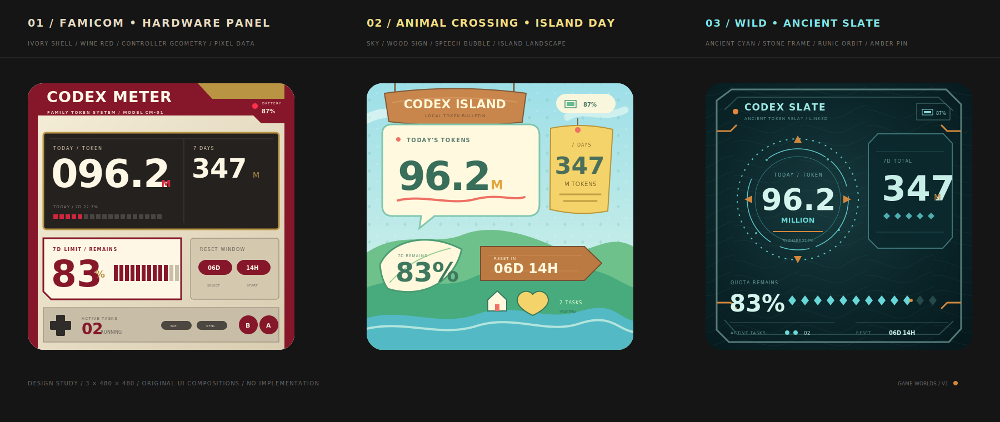
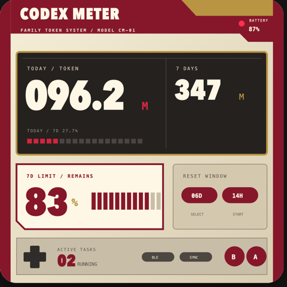
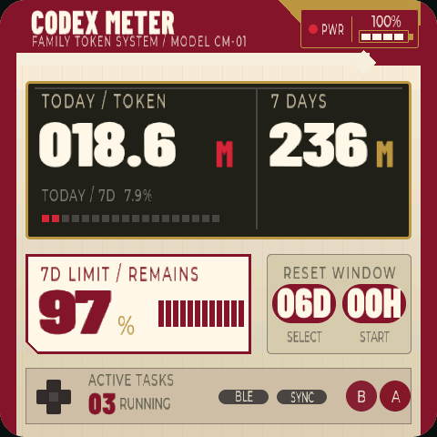

# CodexMeter 游戏世界主题提案 V1

三套主题都会重新组织信息架构和控件形态，不是在同一布局上替换颜色。当前 `Famicom` 与 `Animal Crossing` 已完成 ESP32 端实现和真机视觉验收；旷野之息仍处于设计阶段。

## 01 / 任天堂红白机·硬件面板

- 核心隐喻：整个屏幕是一台正在运行的复古主机，数据区是嵌入式显示窗，底部是手柄操作面板。
- 色彩：老化象牙白外壳、酒红面板、黑褐数据屏和少量金色铭牌。
- 信息结构：今日 Token 和 7 天总量位于主显示窗；剩余额度装入“卡带标签”；重置时间放入 SELECT / START 胶囊键。
- 状态表达：顶部 `BATTERY 87%` 与红色电源灯结合；任务数与十字键、A/B 键形成一条手柄状态轨。
- 进度精度：今日 / 7 天占比使用 18 格点亮 5 格，对应 27.8%；剩余额度使用 12 格点亮 10 格，对应 83.3%。
- 完成动效：POWER 灯闪烁 → 数据窗像素扫光 → A/B 键依次弹起 → `STAGE CLEAR`。

记忆点：不需要出现游戏角色，只看红白机外壳、嵌入屏与手柄几何就能识别主题。

实现状态：已注册为设备端主题 `famicom`，沿用统一 `DashboardViewModel`，不修改 macOS 程序或 BLE 协议。当前仪表盘已实现 POWER 呼吸灯和任务运行时的 A/B 键轻微交替呼吸；完整任务完成动效仍使用系统默认场景，等待 Completion 主题接口启用。

| 设计稿裁切 | 480×480 真机截图 |
| --- | --- |
|  |  |

边界截图：[100% 剩余额度](verification/famicom-theme-100-percent.png) · [6 个运行任务](verification/famicom-theme-six-tasks.png)

## 02 / 动森·岛屿日报

- 核心隐喻：数据不再进入常规卡片，而是成为一座正在营业的小岛营地。
- 色彩：天空蓝、奶油白、薄荷绿、河水青、木质棕和少量珊瑚红。
- 信息结构：今日 Token 进入黄色帐篷；7 天总量是右侧悬挂便笺；剩余额度位于叶片形岛屿徽章；重置时间放入低矮的木制箭头路牌。
- 场景化：顶部悬挂 `CODEX ISLAND` 木牌，电量藏进右上角叶片；狸克位于路牌右侧，底部游客卡片承载任务数、BLE 与同步状态。
- 动态表达：额度叶片使用 10 枚小叶进度格；底部任务区域直接显示空闲状态或运行任务数，保持透明且不遮挡游客卡片。
- 双模式：Token 模式显示 `TODAY TOKEN` / `7 DAYS`；配额模式在相同场景内切换为 `5H REMAINS` / `7D REMAINS`。

记忆点：整个仪表盘像小岛上的一幅早报，每条数据都是场景中的物件。

实现状态：已注册为设备端主题 `animal_crossing`，继续读取统一 `DashboardViewModel`，不修改 macOS 程序或 BLE 协议。复杂静态场景使用无字 RGB565 背景保留插画质感，所有业务数字、模式标题、进度、电量和状态均由 LVGL 透明实时绘制。

| 最终设计稿 | 480×480 真机截图 |
| --- | --- |
|  |  |

视觉对比：[设计稿 / 真机并排图](verification/animal-crossing-design-vs-device-final.png) · [100% + 6 个任务](verification/animal-crossing-edge-100-6tasks.png) · [5h/7d 配额模式](verification/animal-crossing-quota-mode.png)

## 03 / 旷野之息·古代石板

- 核心隐喻：屏幕是一块被唤醒的古代终端，数据从石板雕刻中发光。
- 色彩：深青黑石板、发光青色符文、灰绿石刻边框和少量球珀橙定位点。
- 信息结构：今日 Token 进入中央符文圆盘；7 天总量是右侧竖向石板；剩余额度通过底部菱形符文轨表达。
- 空间细节：等高线纹理、断续圆轨、四向球珀橙定位针和切角石刻边框构成古代仪器感。
- 完成动效：四枚定位针依次点亮 → 符文圆盘旋转一周 → 青色光扫过石板 → 橙色节点锁定任务完成。

记忆点：它不是一张蓝色 HUD，而是一块有厚度、雕刻与发光机构的古代终端。

## 三套主题共同保留的信息

- 今日 Token：`96.2M`
- 近 7 天 Token：`347M`
- 7d 剩余额度：`83%`
- 重置时间：`06D 14H`
- 电量：`87%`
- 运行中任务：`2`

## 后续主题的建议确认顺序

1. 先确认旷野之息的世界观和信息布局。
2. 再确认数字字体、中英文标签和辅助图形。
3. 最后确认动效与真机屏幕上的亮度约束，确认完成后再进入代码实现。
