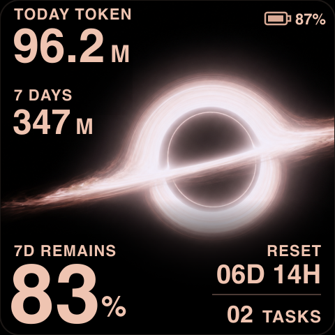
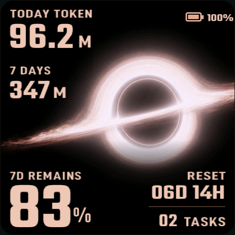

# GARGANTUA 卡冈图雅主题

`GARGANTUA` 是第九套设备端主题，内部稳定 ID 为 `gargantua`。它读取统一的
`DashboardViewModel`，不修改 macOS daemon、BLE payload 或设备端设置格式。

| 最终设计稿 | 最终真机画面 |
| --- | --- |
|  |  |

## 视觉与布局

- 以电影中的卡冈图雅为主视觉：黑洞整体倾斜，完整保留左侧吸积盘，并以较厚的上下引力透镜像、奶白到暗铜色物质流和柔和曝光还原电影感。
- 信息采用非对称四角布局：左上为 `TODAY TOKEN` 和 `7 DAYS`，右上为电池，左下为 `7D REMAINS`，右下为紧凑右对齐的 `RESET` 与 `TASKS`。
- 全部文字使用暖粉色 `#EFC4B1`；数字采用 Teko SemiBold，标签与单位采用 D-DIN Condensed Bold，最小字号不低于 22px，保证 4cm × 4cm 实屏可读。
- 顶部模块相对早期设计累计下移 8px；左侧三组标签和数值按实际可见像素统一到 `x=21`，而不是只依赖字体对象边界。
- Token 数值与单位动态分离并按实际宽度排布；7 天剩余额度在三位数时自动收窄，RESET 天数和任务数均限制为两位，避免边界数据破坏布局。

## 运行时分层

静态层使用 `firmware/data/themes/gargantua_bg.rgb565`，保存 480×480、RGB565
little-endian、无文件头的黑洞场景。背景载入 PSRAM 后由 LVGL 作为全屏图片显示；
今日 / 近 7 天 Token、额度、电池、RESET 和任务数均由透明 LVGL 对象实时覆盖。
主题卸载时会释放背景缓冲、对象树和 TinyTTF 字体实例，资源加载失败时由统一主题
运行时回退到 `classic`。

发布保留以下源文件：

- `docs/assets/interstellar-gargantua-v12.png`：带示例数据的最终视觉参考。
- `docs/assets/interstellar-gargantua-v12-clean.png`：无动态文字的运行时栅格源图。
- `docs/assets/interstellar-gargantua-v8-background.png`：两份 SVG 共同引用的高分辨率基础黑洞原图。
- `docs/assets/interstellar-gargantua-v12.svg`：最终视觉参考的可编辑 SVG 构图源文件。
- `docs/assets/interstellar-gargantua-v12-clean.svg`：无动态文字的可编辑 SVG 构图源文件。

## 验证

- 宿主 Python 回归测试通过，主题没有改变数据模型或通信协议。
- `waveshare_amoled_216` 固件完整编译通过，RGB565 背景尺寸校验为 460800 字节。
- 在设备 `CodexMeter-646355` 完成 LittleFS 与固件烧录，确认主题可挂载、数据可更新、自动旋转已启用。
- 通过 USB 物理方向截图复核 480×480 输出，最终校准顶部安全距离、左侧标签 / 数值对齐、右侧状态对齐及 4cm 实屏可读性。
