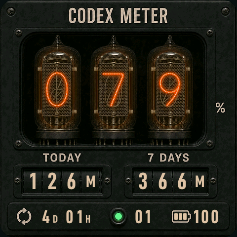

# NIXIE RACK 主题：真机定稿



## 设计结论

最终方案采用美式机架计数器，而不是把橙色发光字体直接放在黑色背景上：

- 三支真实冷阴极辉光管显示 7 天剩余额度，固定为三位并保留前导零。
- 玻璃顶部排气嘴、阳极网、未点亮阴极堆栈、云母支架、管座和管脚均保留在静态层。
- 点亮阴极使用十枚独立 ARGB8888 精灵，运行时额外叠加宽范围琥珀辉光，使阳极网、玻璃肩部和管座共同被照亮。
- 黑色阳极氧化铝、烟熏窗口和低亮刻字压低环境亮度，让辉光管保持唯一主视觉。
- Today、7 Days、RESET、任务与电量均使用适合约 4cm 屏幕的大字号，不依赖难以辨认的微型说明文字。

## 动态信息与滚轮

- `TODAY < 100M` 时保留小数滚轮，例如 `96.2M`。
- `TODAY = 100M–999M` 时切换为三枚 39px 等宽整数滚轮和一枚等宽单位滚轮，不留下空的小数槽。
- Today 与 7 Days 的数字均按滚轮几何中心定位；完成 `0–9` 真机逐字扫描，并对 D-DIN 的 `7` 进行 1px 光学校正，最终中心误差不超过 0.5px。
- RESET 的 `D` / `H` 使用较小字号并与数值底部对齐；任务数保持两位动态显示。
- 电量来自 AXP2101 的真实 PMU 读数，以三枚等宽、水平和垂直居中的格子表达，并保留数值百分比。

## 资源分层

- `nixie_bg.rgb565`：480×480 RGB565 静态机架、玻璃管和金属结构。
- `nixie_digit_0.argb8888` 至 `nixie_digit_9.argb8888`：90×108 动态阴极与近场辉光。
- `nixie_today_integer.rgb565`：Today 整数模式的四等分滚轮内层。
- LVGL 动态层：主管辉光、Today / 7 Days、单位、RESET、任务、电量与状态灯。

可重复生成命令：

```bash
python3 tools/generate_nixie_digit_assets.py --install design
python3 tools/generate_nixie_background_assets.py --install design
```

## 真机验收

- 完成背景亮度、金属质感、阴极高度与垂直位置、阳极网染色和玻璃环境辉光校准。
- 覆盖 `77.7M`、`96.2M`、`100M`、`777M`、`888M`、真实电量、三格电池、两位任务和 RESET 对齐。
- 完成 128 项宿主回归测试、`waveshare_amoled_216` 固件编译、LittleFS 与固件烧录。

本主题只扩展 ESP32 展现层与 USB 视觉 QA 命令，没有修改 macOS 用量读取逻辑或 BLE payload。
