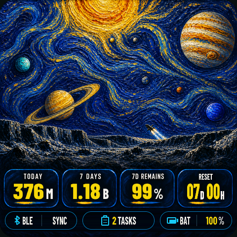
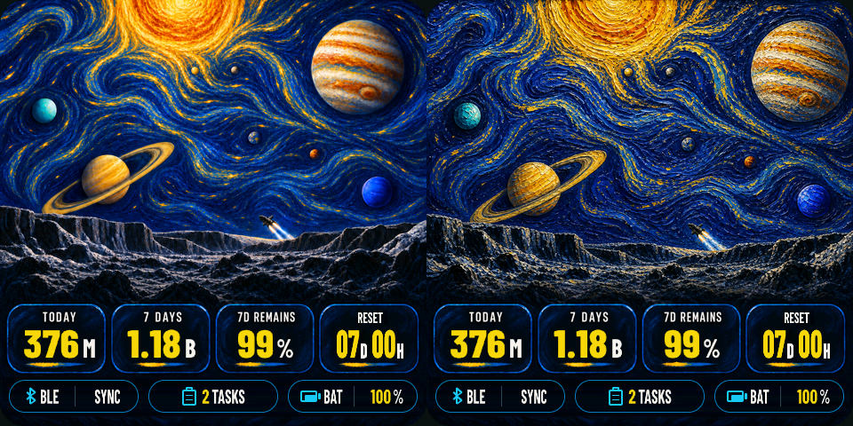
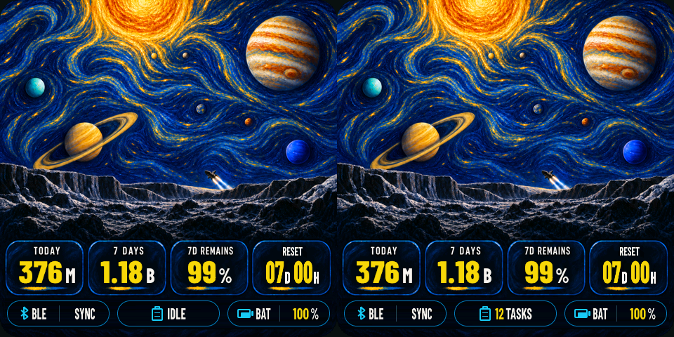

# THREE BODY 主题：真机定稿

## 布局调整

- 移除右下角四颗没有数据含义的静态装饰圆点。
- 底栏改为三枚 146px 等宽胶囊，左右边距与胶囊间距统一。
- 左侧胶囊显示 `BLE / SYNC`，中间显示任务数，右侧显示 `BAT / 电量`。
- BLE、剪贴板和电池图标全部改为 LVGL 矢量元素，不再依赖背景中的静态图标。
- 电池填充宽度、同步状态和任务数均继续跟随实时数据。
- 底栏文字统一放大，共享同一基线并在各自分区中水平、垂直居中。
- 任务状态会正确切换 `IDLE`、`1 TASK` 和 `N TASKS`。
- 底栏以“图标 + 文字”为整组居中，任务组会根据实时文案宽度动态重排。
- 蓝牙状态使用完整的交叉折线图标，不再使用类似字母 `B` 的简化轮廓。
- 太阳系与冥王星地表改为更明显的厚涂油画质感：使用中等尺度的旋转短笔触、群青/钴蓝颜料层和金黄厚涂高光，避免在 4cm 屏幕上退化成细碎噪点。
- 下方数据卡片保留原有几何、留白和深色背景，不让油画纹理干扰实时文字。

## 真机验收

- 已验证 `100%`、`1.18B`、`IDLE`、`2 TASKS` 和 `12 TASKS`。
- RGB565 转换后的油画笔触仍然清晰，数据卡片与底栏没有受到高频纹理干扰。

本轮只调整 ESP32 主题展现层，没有修改 Mac 端或 BLE 协议。
