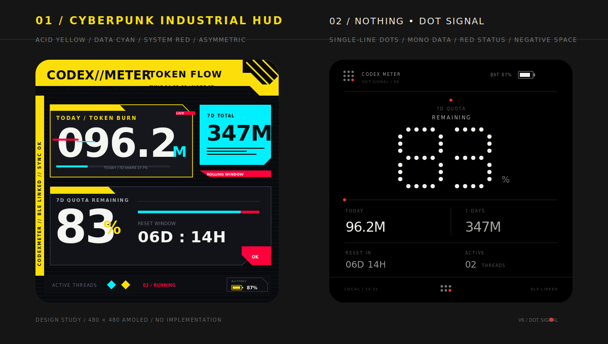

# CodexMeter 世界观主题提案 V6（待确认）

这份稿件用于确认视觉方向，尚未进入代码实现。本轮不再把主题理解为颜色皮肤，而是为每个主题重新设计信息架构、字体、构图、装饰系统和动效语言。

## 01 / Cyberpunk Industrial HUD

这套方向不再使用常见的紫色渐变霓虹，而是借鉴《Cyberpunk 2077》的工业广告与战术 HUD 气质：

- 色彩：酸性黄 `#FCDF0A` 作为大面积识别色，数据青 `#00F0FF` 表示实时流量，系统红 `#FF003C` 表示告警与故障切片。
- 构图：顶部黄色设备铭牌、左侧纵向遥测轨、切角数据舱和不对称信息块；完全取消原来的等宽双卡片布局。侧轨只显示 `BLE LINKED / SYNC OK` 等真实设备状态，不再展示含义不明确的 `//480`。
- 字体：超粗压缩数字负责冲击力，等宽微文案负责机器感；数值统一保留前导零，例如 `096.2M`。
- 品牌字标：顶部直接使用 `CODEX//METER`；不再使用需要额外解释的 `C//MTR` 压缩缩写。
- 细节：扫描线、斜纹危险区、条码式刻度、微型设备编号、红/青错位切片。
- 今日用量条：明确表示“今日 Token 占近 7 天 Token 总量的比例”，示例数据为 `96.2M ÷ 347M = 27.7%`，不使用虚构进度。
- 7d 总量：扩大青色模块，并将 `347M` 作为一个完整数值显示。
- 电量：底部状态轨改为明确的电池外形、黄色电芯和 `BATTERY 87%`，不再使用难以识别的 `PWR 87`。
- 活动任务：使用发光菱形节点，并显示 `02 / RUNNING`，更像正在工作的系统进程。
- 完成提醒动效建议：红色故障切片闪入 → 青色扫描线扫过全屏 → 黄色 `JOB COMPLETE` 铭牌锁定。

记忆点：桌面上一眼看过去，像一块从未来工业设备上拆下来的实时遥测终端。

## 02 / Nothing Dot Signal

V6 不再修补原有的“大数字 + 进度环 / 灯带”布局，而是从信息层级开始重新设计：

- 核心读数：`83%` 是屏幕中唯一的点阵数据，使用单排圆点描出数字骨架，居中占据主视觉。
- 进度表达：取消进度条、环形进度和重复的 Glyph 比例；`83%` 本身已足以准确传达剩余额度。
- 字体系统：除主读数外，品牌、Token 数据、重置时间、电量和状态全部统一使用等宽字体，不再混用超粗压缩字体。
- 构图：上方是设备状态，中间是配额主读数，下方使用两列对称网格展示今日 / 7 天 Token 与重置 / 任务信息。
- 色彩：纯黑底、暖白读数、冷灰辅助信息和少量红色状态点；不使用卡片背景。
- 完成提醒动效建议：主读数的圆点由上至下依次点亮 → 顶部红点双闪确认 → 底部状态点返回静态。

记忆点：一个像仪表读数的大型点阵数字，其余信息像设备标注一样安静地围绕它。

## 两套主题共同保留的信息

- 今日 Token、近 7 天 Token、7d 剩余配额、重置时间、电量和运行中任务数。
- 数值仍然是第一视觉层级，装饰不能遮挡或降低识别速度。
- 保持 AMOLED 黑色像素优势，并继续考虑固定像素漂移。

## 待确认

1. Cyberpunk 是否接受大面积酸性黄，还是希望整体更暗、只让黄色作为局部铭牌。
2. Nothing 暂定不设配额进度条，只使用大型 `83%` 点阵读数。
3. 微型标签是否接受英文；主要信息仍可保留中文。
4. 主题完成提醒是否采用各自独立的动效语言。
5. 极客主题将在这两个方向确认后单独设计，避免再次落入简单换色。
