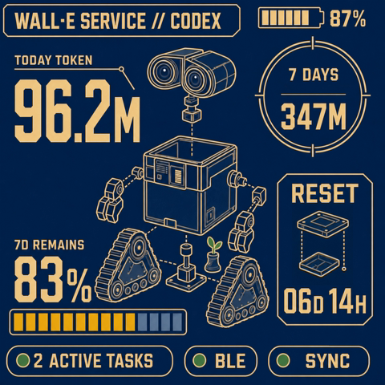
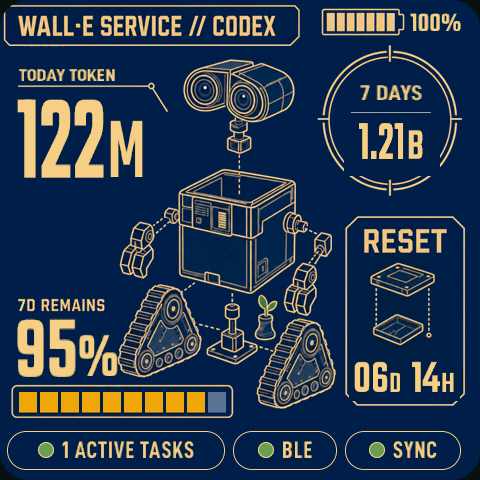
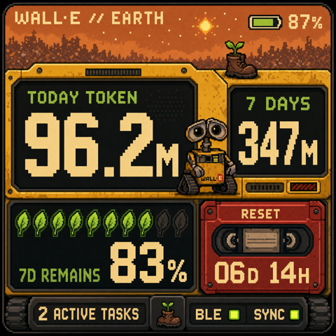
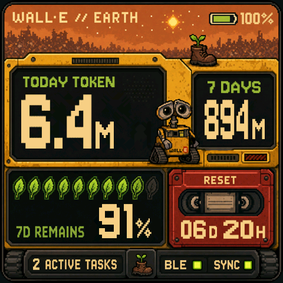
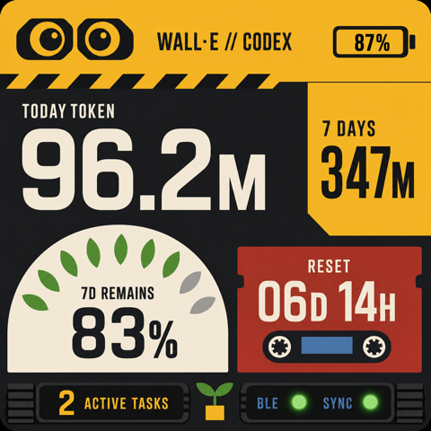
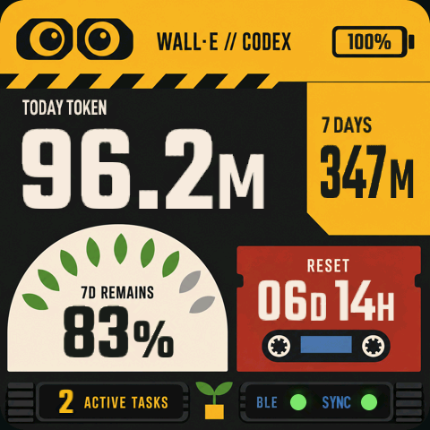

# CodexMeter WALL-E 系列主题

CodexMeter 内置三套彼此独立的 WALL-E 仪表盘：原有的黄黑工程终端
`WALL-E`、以地球复育和夕阳废土为核心视觉的 `WALL-E EARTH`，以及
以机器人维修图纸为核心视觉的 `WALL-E BLUEPRINT`。三者拥有不同对象树
和资源，但都只读取统一 `DashboardViewModel`；
macOS 程序和 BLE 协议没有主题专用字段。

## WALL-E BLUEPRINT



`WALL-E BLUEPRINT` 是第八套设备端主题，内部稳定 ID 为
`walle_blueprint`。480×480 界面以深海军蓝为底、暖金线稿为主，中央使用
WALL-E 爆炸结构图展示双目、机身、机械臂、幼苗和三角履带。左侧承载今日
Token 与 7d 剩余额度，右上圆形仪表显示近 7 天用量，右下维修框显示 RESET，
底栏分别显示任务数、BLE 和同步状态。

### 实现与资源

- `firmware/src/walle_blueprint_theme.*` 实现独立主题生命周期、动态标签、
  十格额度与七格电池更新，以及 LittleFS / PSRAM 资源管理。
- `walle_blueprint_bg.rgb565` 是移除所有运行时字段后的静态蓝图；设计参考与
  干净运行时 PNG 分别为 `assets/walle-theme-v15-refined-v4.png` 和
  `assets/walle-theme-blueprint-clean.png`。生成器会识别与屏幕边缘连通的蓝图纸
  区域，在保留暖金线稿与封闭阴影的前提下重建一张连续底色，避免
  动态文字擦除区留下矩形色差。
- `walle_blueprint_bar_active.rgb565`、
  `walle_blueprint_bar_inactive.rgb565` 与
  `walle_blueprint_bar_mask.bin` 保存十个格位的亮态、暗态和像素掩码。
- `walle_blueprint_battery_active.rgb565`、
  `walle_blueprint_battery_inactive.rgb565` 与
  `walle_blueprint_battery_mask.bin` 让七格电池图标与真实电量同步，不再
  使用设计稿中固定的 87% 填充。
- Teko SemiBold 绘制动态数值与单位，D-DIN Condensed Bold 绘制标签和
  任务状态；静态工程线稿直接保留设计稿像素。

运行时资源可从最终设计参考确定性生成：

```bash
python3 tools/generate_walle_blueprint_theme_assets.py
```

### 动态与真机校准

- Token 模式显示 `TODAY TOKEN` / `7 DAYS`；配额模式显示
  `5H REMAINS` / `7D REMAINS`。
- 十格进度条按剩余百分比向下取整：83% 显示八亮二暗，95% 显示九亮一暗，
  100% 全部点亮。每格固定为 18px 宽、22px 高，相邻格固定间隔 3px；亮态
  与暗态均复用同一份逐行色彩模板，不再拉伸设计稿中宽度不同的旧格位。
- 7 DAYS 将数值和 `M/B/%` 单位拆成独立对象：数字保持可读，单位缩小并与
  数值底部对齐，为圆形仪表保留更充足的左右留白。
- RESET 的天 / 小时拆成两组独立布局，统一可见底边，并在维修框内保留
  7–8px 左右内边距和清晰的组间间隔。
- RESET 爆炸图由三层结构件简化为两层；7 DAYS 分割线上移 5px，数值与
  单位组同步上移 6px。
- 底栏三个胶囊统一使用 D-DIN Condensed Bold 24px 字体和相同缩放；任务区
  为 218px，BLE 区为 104px，SYNC 区为 116px，胶囊间距统一为 8px。
- 边界验证覆盖 `128M`、`1.14B`、`100%`、`12D 23H`、12 个活动任务和
  5h/7d 百分比兼容模式。

| 最终设计稿 | 480×480 真机截图 |
| --- | --- |
|  |  |

像素比对：[最终设计稿与当前真机并排图](verification/walle-blueprint-design-vs-final.png)。

## WALL-E EARTH



`WALL-E EARTH` 是第七套设备端主题，内部稳定 ID 为 `walle_v10`。
480×480 界面保留夕阳城市剪影、幼苗靴、WALL-E 主体和机械面板纹理：
左右屏幕显示今日与近 7 天 Token，十枚叶片表达 7d 剩余额度，磁带区域
承载 RESET 倒计时，履带状态栏显示任务数、BLE 和同步状态。

### 实现与资源

- `firmware/src/walle_v10_theme.*` 实现主题生命周期、动态标签、叶片更新和
  LittleFS / PSRAM 资源管理。
- `walle_v10_bg.rgb565` 是移除动态文字后的静态场景；设计稿和干净运行时
  PNG 分别保存在 `assets/walle-theme-v10.png` 与
  `assets/walle-theme-v10-clean.png`。
- `walle_v10_leaves_active.rgb565`、
  `walle_v10_leaves_inactive.rgb565` 与 `walle_v10_leaves_mask.bin`
  保存十枚叶子的亮态、灰态和像素掩码。
- Jersey 10 绘制像素显示器文字；字体按 SIL Open Font License 1.1
  随固件资源分发。

运行时资源可从最终设计参考确定性生成：

```bash
python3 tools/generate_walle_v10_theme_assets.py
```

生成器会移动顶部标题和 RESET 静态标签，清理所有运行时数值与任务数，
提取十枚叶片并统一各叶槽的亮暗色阶，然后输出 RGB565 小端资源。

### 动态与像素校准

- Token 模式显示 `TODAY TOKEN` / `7 DAYS`；配额模式显示
  `5H REMAINS` / `7D REMAINS`。
- 叶片按剩余百分比向下取整：90%–99% 为九亮一灰，100% 才十枚全亮。
- 7 DAYS 数值和单位组成一个整体，以 `x=399` 为中心；不同位数自动收缩，
  数值与单位保持共同可见底边。
- RESET 的天 / 小时数值分别与 `D` / `H` 对齐；底部任务数与静态
  `ACTIVE TASKS` 文本分层渲染。
- 顶部标题、电池、额度百分比和状态栏均经过 480×480 真机截图校准。

| 最终设计稿 | 480×480 真机截图 |
| --- | --- |
|  |  |

## WALL-E 工程终端



原有 `WALL-E` 主题内部 ID 为 `walle`。整个界面被组织为一台黄黑工程
机器人仪表：双目镜头和电池位于顶部，警示带划分信息层级，Token 数据进入
左右遥测区，额度由九片幼苗叶表达，RESET 使用磁带计时器，底部履带区域
承载任务、BLE 与同步状态。

- `firmware/src/walle_theme.*` 实现独立 LVGL 对象树与主题生命周期。
- `walle_bg.rgb565` 保存无动态文字的机械背景；
  `walle_leaves_active.rgb565` 与 `walle_leaves_mask.bin` 保存九片叶轮廓。
- Teko SemiBold 负责数值与单位，D-DIN Condensed Bold 负责仪表标签。

旧主题资源可通过以下命令重新生成：

```bash
python3 tools/generate_walle_theme_assets.py
```

| 最终设计稿 | 480×480 真机截图 |
| --- | --- |
|  |  |

边界截图：[近 7 天用量 1.14B](verification/walle-theme-1.14b.png)
